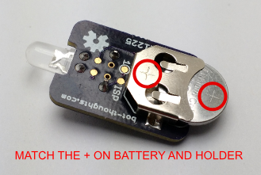
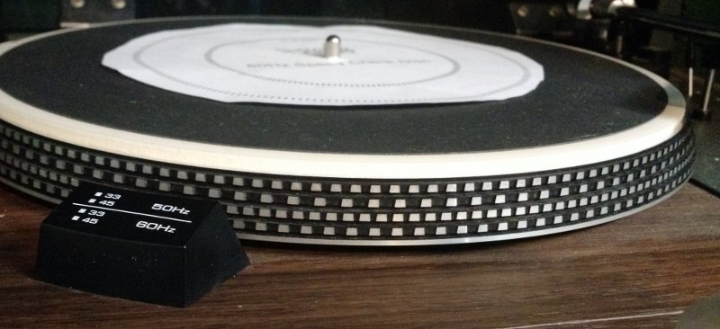
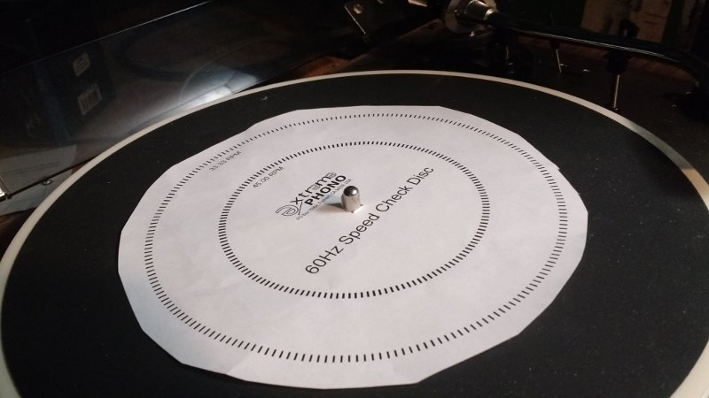
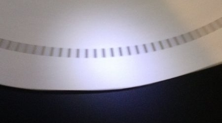
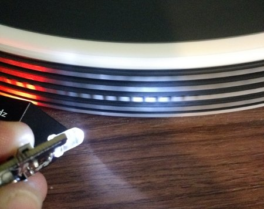
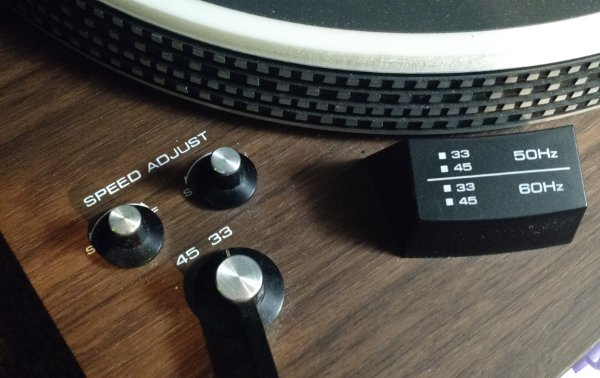

# TurntableStrobe User Manual
Use TurntableStrobe, a highly accurate, tiny, hand held LED strobe, to check the pitch calibration of your turntable.

## Why Calibrate?
To ensure your records play back at the correct pitch (speed), you need to calibrate your deck using a turntable strobe. For the highest accuracy, TurntableStrobe uses a quartz crystal rated ±0.003% accuracy at 25°C, more than accurate enough to ensure a precise calibration.

Though many turntables have built-in strobes, they run off of the mains frequency which [varies over time](http://dabbledoo.weebly.com/mains-frequency.html). And, many turntables have no strobe. In either case, TurntableStrobe provides a quick and easy, but highly accurate, calibration reference at low cost.

## Getting Started
* Remove TurntableStrobe and the CR1225 battery from the anti-static bag
* Remove the CR1225 battery from its bubble
* Match the ```+``` symbol on the battery and battery holder
* Insert the battery with the ```+``` symbols facing up.
* Just press the button on top to activate the strobe.



## How to Calibrate Your Turntable
If your turntable's platter has timing marks (pictured below) skip to *Checking Calibration*. Otherwise, you can print a strobe disc as explained below.

  
*My Realistic Lab-400 has 50Hz and 60Hz timing marks. Strobe disc also pictured.*

1. Download one of these free turntable strobe discs on your printer:
  * [60Hz.pdf](http://www.extremephono.com/ftp/60Hz.PDF) for 60Hz TurntableStrobe
  * [50Hz.pdf](http://www.extremephono.com/ftp/50Hz.PDF) for 50Hz TurntableStrobe
* Cut out the disc and cut out a hole for the turntable spindle.
* Remove any records from the turntable
* Place the strobe disc on the turntable



### Checking Calibration
1. Start the turntable (refer to your owner's manual if necessary)
* Select the timing marks corresponding to the current turntable speed
* Hold the TurntableStrobe at least 2" (5cm) away from the timing marks (on the platter or strobe disc, as applicable)
* Press the TurntableStrobe button to activate the light
* The timing marks should now appear distinct though possibly a little bit blurry
* If the marks appear to be moving slowly, then the speed/pitch calibration is incorrect

  
*Calibration using a strobe disc*

  
*Calibration using platter timing marks*

If your turntable has an external pitch or speed adjustment knob, you can now adjust the speed of your deck.

### Adjusting Pitch
Some turntables have separate speed / pitch knobs for 45 rpm and 33-1/3 rpm, while others only have a single pitch knob.

  
*My LAB-400 has independent adjustments for 45 RPM and 33-1/3 RPM.*

1. Find the pitch knob corresponding to the current speed of the turntable.
* Adjust the pitch knob very slowly until the timing marks appear to be stationary
* You may find the marks will slowly oscillate forward and backward.
  * This variation in pitch is normal and is called *wow*.
  * Typically, better turntables have lower variation in pitch.
* To calibrate for an *average* speed, ensure the timing marks appear to move forward and backward by the same amount; that is, they remain stationary *on average*.
* It may not be possible to get it perfect. Just do your best.

## Troubleshooting

### Timing marks are an indistinct blur

| Cause | Solution |
| ----- | -------- |
| Mismatch between timing marks and strobe | Make sure the platter timing marks (or strobe disc) match the frequency of your turntable strobe. |
| 45 RPM speed selected but 33-1/3 timing marks are illuminated, or vice versa | Strobe discs and turntable platters use two sets of timing marks, one for each speed. Illuminate the marks corresponding to the speed selection of your turntable. |
| Problem with turntable speed | You could try replacing the belt (if applicable), or have the turntable checked and serviced if necessary. There could be a problem with the motor, the speed controller, or something else I haven't thought of. |

### Timing difficult to make perfectly stationary

| Cause | Solution |
| ----- | -------- |
| Speed/Pitch potentiometer is dirty | Clean potentiometer with Deoxit and lubricate with FaderLube or equivalent |
| Turntable wow | Lower end turntables may have a fair bit of wow. As long as you can't hear pitch variation when playing back long, sustained notes, you can ignore the wow and do your best to adjust pitch. If wow sounds excessive, you can try cleaning and lubricating the pitch potenitometer as above, replacing the belt if applicable, and/or having the turntable checked and serviced. |

### Strobe light is very dim or strobe does not light up at all

| Cause | Solution |
| ----- | -------- |
| Battery is low | Change battery |

If you are still having problems, please [contact me on Tindie](https://www.tindie.com/stores/bot_thoughts/) and I'll do my best to help you out.

## Accuracy
The quartz crystals selected for use on the Turntable strobe modules have a frequency tolerance of ±30 ppm at 25 ºC (±0.003%). Temperature stability is ±30 ppm over (-20ºC - +70ºC) but of course we can expect a much narrower tolerance for normal indoor temperatures.

I measure the frequency of every single TurntableStrobe before selling it. So far. frequencies range between -0.0015% to -0.0035% of the target frequency. Testing is conducted in my basement at around 20-25°C using a Saleae Logic analyzer with 42ns accuracy.
